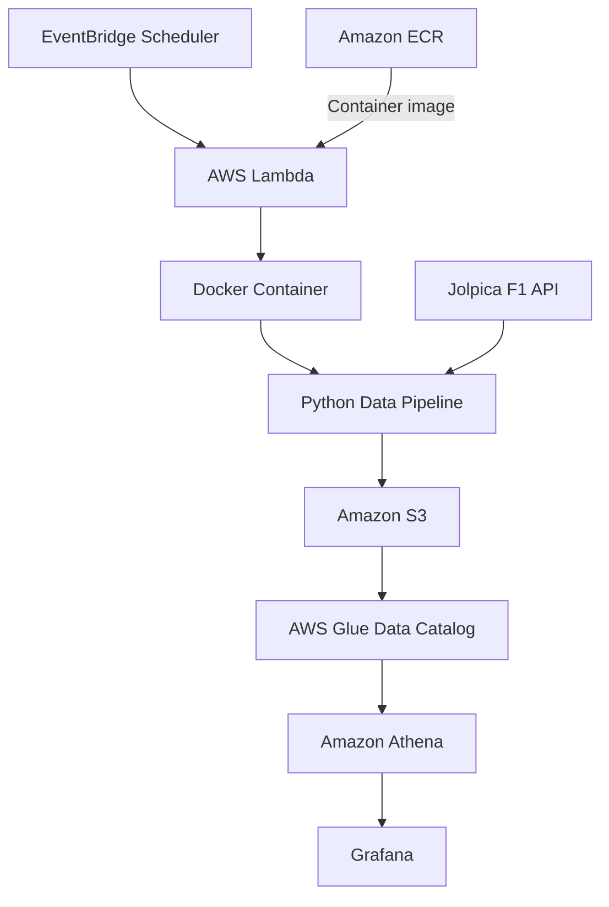
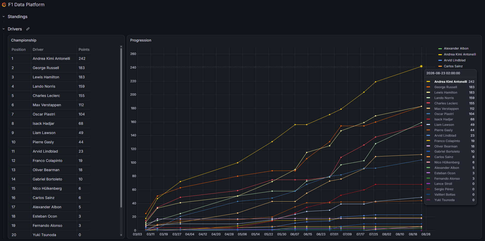
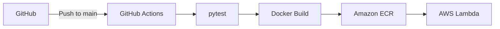

# 🏎️ F1 Data Platform


An ongoing personal **Data Engineering project** for collecting,
processing, storing and querying Formula 1 data.

The platform collects data from the **Jolpica F1 API**, transforms it
into structured Parquet datasets and stores the data in **Amazon S3**.
The datasets are registered in the **AWS Glue Data Catalog** and can be
queried using **Amazon Athena**.

The project is continuously evolving as I explore and implement new
Data Engineering concepts and practices.

## 📑 Table of Contents

- [Architecture](#🏗️-architecture)
- [Features](#🚀-features)
- [Data](#📊-data)
- [Data Visualization](#📈-data-visualization)
- [Data Pipeline](#🔄-data-pipeline)
- [Project Structure](#🗂️-project-structure)
- [Tech Stack](#🛠️-tech-stack)
- [CI/CD](#🔄-cicd)
- [Testing](#🧪-testing)
- [Local Development](#💻-local-development)
- [Project Status & Goals](#📌-project-status--goals)
- [License](#📄-license)

## 🏗️ Architecture



GitHub Actions authenticates with AWS using **OIDC** and an IAM role,
avoiding the use of long-lived AWS credentials in GitHub. See
[CI/CD](#🔄-cicd) for the full deployment flow.

## 🚀 Features

- Automated ingestion from the Jolpica F1 API
- Season and round based data partitioning
- Idempotent processing to avoid unnecessary reprocessing
- SQL analytics through Amazon Athena
- Serverless, scheduled execution (Lambda + EventBridge)
- Infrastructure as Code with Terraform
- Containerized deployment with Docker and Amazon ECR
- Automated testing and CI/CD with GitHub Actions

A full breakdown of the technologies behind these features is listed
under [Tech Stack](#🛠️-tech-stack).

## 📊 Data

The platform currently processes several types of Formula 1 data:

| Dataset | Description |
| --- | --- |
| Races | Race calendar and event information |
| Drivers | Driver reference data |
| Constructors | Constructor/team reference data |
| Race results | Results from completed races |
| Sprint results | Results from completed sprint events |
| Driver standings | Historical driver championship standings |
| Constructor standings | Historical constructor championship standings |

Data is stored as Parquet files in Amazon S3 and registered in the
AWS Glue Data Catalog for querying through Amazon Athena.

## 📈 Data Visualization

The platform is also connected to Grafana for data visualization and
dashboarding, allowing the collected data to be explored through
interactive dashboards.

The Grafana integration is currently being further developed, with a
focus on improving the dashboards and presenting the collected F1 data
more effectively.



*Example Grafana dashboard using data collected and processed by the
F1 Data Platform.*

## 🔄 Data Pipeline

The pipeline performs the following steps:

1. Resolve the target season.
2. Retrieve race, driver and constructor reference data.
3. Store reference data as Parquet datasets.
4. Process completed race results.
5. Process available sprint results.
6. Process historical driver standings.
7. Process historical constructor standings.
8. Store datasets in Amazon S3.
9. Register and maintain Glue Catalog partitions.

The pipeline is designed to be repeatable and safe to run multiple times.

Before processing a dataset, the pipeline checks whether the
corresponding Parquet object already exists. If it does, processing is
skipped while the corresponding Glue partition is still ensured.

This provides a basic form of **idempotent processing** and also allows
the pipeline to recover from cases where data was successfully written
but catalog registration was not completed.

## 🗂️ Project Structure

```text
.
├── infrastructure/
│   └── terraform/       # AWS infrastructure
├── lambda/
│   └── handler.py       # AWS Lambda entry point
├── src/
│   └── f1_data/
│       ├── catalog.py       # Glue Catalog operations
│       ├── jolpica.py       # Jolpica API client
│       ├── models.py        # Data models
│       ├── parsers.py       # API response parsing
│       ├── pipeline.py      # Pipeline orchestration
│       ├── storage.py       # S3 / Parquet storage
│       └── transformers.py  # Data transformations
├── tests/                # Automated tests
├── Dockerfile
├── run_pipeline.py       # Local pipeline entry point
└── pyproject.toml
```

## 🛠️ Tech Stack

| Category | Technologies |
| --- | --- |
| **Programming & Data** | Python, SQL, Parquet, pytest |
| **AWS** | S3, Glue Data Catalog, Athena, Lambda, EventBridge Scheduler, ECR, IAM |
| **Infrastructure & DevOps** | Terraform, Docker, GitHub Actions, Git |
| **Visualization** | Grafana |

The Terraform configuration manages all AWS resources listed above,
keeping infrastructure version-controlled alongside the application code.
The pipeline itself is packaged as a Docker container using the AWS
Lambda Python 3.12 base image, built and deployed via the CI/CD workflow
below.

## 🔄 CI/CD

The project uses **GitHub Actions** for automated testing and deployment.



On every push to the `main` branch, the workflow:

1. Installs the Python dependencies
2. Runs the automated test suite
3. Authenticates with AWS using GitHub Actions OIDC
4. Builds the Docker image for AWS Lambda
5. Pushes the image to Amazon ECR
6. Updates the Lambda function to use the new image

This provides an automated path from a change in the GitHub repository
to a deployed version of the data pipeline.

## 🧪 Testing

The project includes automated tests covering the main components of
the data platform, written with **pytest**:

- API client behaviour
- Data parsing and transformation
- S3 storage and Glue Catalog operations
- Pipeline processing

The test suite is automatically executed as part of the CI/CD workflow
above.

## 💻 Local Development

### Requirements

- Python 3.12+
- Docker
- Terraform
- AWS account

### Install dependencies

```bash
python -m venv .venv
source .venv/bin/activate
pip install -e ".[dev]"
```

### Configure AWS access

No `.env` file is used. AWS access is handled per context:

- **Local:** the AWS CLI / `boto3` uses your locally configured AWS
  credentials (`aws configure`).
- **Terraform:** also uses your local AWS CLI credentials to manage
  infrastructure.
- **GitHub Actions:** authenticates via GitHub OIDC and an IAM role
  (no stored credentials).
- **AWS Lambda:** required environment variables (e.g.
  `F1_DATA_BUCKET`, `ATHENA_DATABASE_NAME`) are provided by Terraform
  as part of the infrastructure deployment.

Make sure your AWS CLI is configured (`aws configure`) before running
the pipeline or Terraform locally.

### Run tests

```bash
pytest
```

### Run the pipeline locally

```bash
python run_pipeline.py
```

## 📌 Project Status & Goals

**Status: Ongoing**

This project is both a practical portfolio project and a way to
continuously develop my Data Engineering skills, with a focus on data
ingestion, transformation, cloud data platforms, Infrastructure as Code,
and data quality/reliability.

Current work includes:

- Expanding the data platform with additional datasets
- Improving pipeline reliability
- Further developing the AWS data architecture
- Expanding automated tests and CI/CD
- Improving the Grafana dashboards
- Improving project documentation and architecture diagrams

## 📄 License

This project is licensed under the [MIT License](LICENSE).